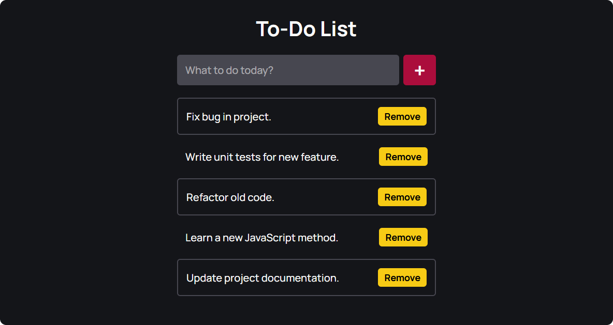

# To-Do List

A simple To-Do list application built with HTML, CSS, and JavaScript. Add, remove, and manage your tasks with ease.

## Features

- Add tasks
- Remove tasks
- Local storage support

## How to Use

1. Type your task in the input field.
2. Click **Add** to add the task to your list.
3. Click **Remove** to delete a task.
4. Your tasks are saved automatically in your browser.

## Installation

1. Clone the repository:
    ```bash
    git clone https://github.com/jobsow/simple-todo-list.git
    ```
2. Open the `index.html` file in your browser.

## License

This project is licensed under the MIT License.

## Preview

